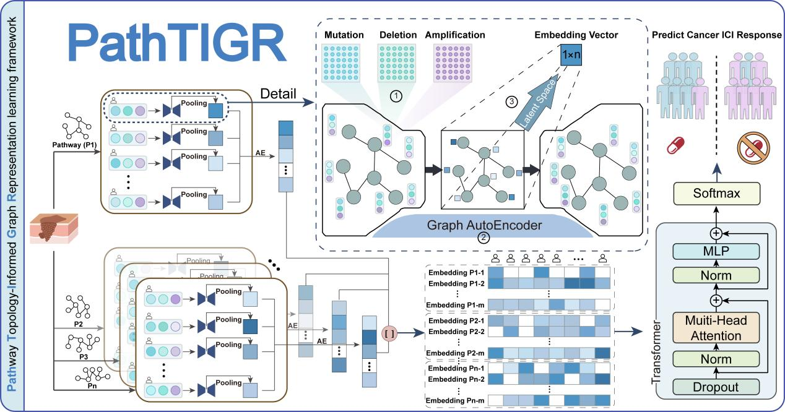

# PathTIGR: A pathway topology-informed graph representation learning framework for immunotherapy response prediction
-----------------------------------------------------------------
This repository contains source code and data for **PathTIGR**. 

## 1. Introduction

**PathTIGR** is a Pathway Topology-Informed Graph Representation learning framework that systematically integrates biological pathway network topology knowledge with genome variation information for immunotherapy response prediction.
PathTIGR employs a three-component design: (1) pathway graph encoder with multi-head attention embedding pathway topology knowledge and cancer genomic variants to pathway activity representation; (2) transformer module capturing pathway regulatory dependencies, (3) multilayer perceptron synthesizing pathway-level representations to predict immunotherapy response. This architecture enables PathTIGR to capture complex molecular interactions underlying immunotherapy response while maintaining biological interpretability.

## 2. Design of PathTIGR



Figure 1: Overall architecture of PathTIGR

## 3. Installation

* Python (version 3.9.21)
    * **PathTIGR** relies on [Python (version 3.9.21)](https://www.python.org/downloads/release/python-390/) environments.
* Anaconda
    * Comprehensive installation instructions for Anaconda are available at: https://docs.conda.io/projects/conda/en/latest/user-guide/install/.

    * Following the installation of Anaconda, a virtual environment designated as PathTIGR can be created, and the requisite dependencies can be installed from the ``GAE_environment.yml`` configuration file by executing the following command:
    ```
    conda env create -f GAE_environment.yml
    ```
* PyTorch
    PyTorch requires a separate installation tailored to the specific hardware configuration. The appropriate installation command can be obtained from https://pytorch.org/.


## 4. Usage

This study trained **PathTIGR** models for different immunotherapy inhibitors separately. All the codes and data required to execute **PathTIGR** are provided in this GitHub repository. Please make sure to replace the input data path in the code with your own storage location.

### 4.1. Code
- The complete code for **PathTIGR** in the located at folder ``Code/``, with the details of each file as follows:

| File                              | Description                                                                   |
|------------------------------------|------------------------------------------------------------------------|
| pathway_activity.ipynb | Train the autoencoder on pathway diagrams for generating pathway activity profiles.                                       |
| predict.ipynb | Training the PathTIGR model for predicting the cancer immunotherapy response.                                       |

#### 1. Users may reproduce the **PathTIGR** model by following the implementation provided in **pathway_activity.ipynb**, or retrain the model using custom datasets. The principal trainable parameters are specified as follows:
  
```
with open("../Data/pathways_adjacency_matrix_without_disease.pkl", "rb") as f:
    pathways_matrix = pickle.load(f)
with open("../Data/Liu/com_data_144.pkl", "rb") as f:
    com_data = pickle.load(f)

pathway_model, patient_feature = train_pathway_model(pathways_matrix = pathways_matrix, features_matrix_list = com_data, attn_type="graph", GAE_epochs = 30000, learning_rate = 0.01, num_heads = 1,
                                   ratio_val = 0, seed = 666, hidden1_dim = 3, hidden2_dim = 1, save_path = '/test_Data', patience = 20,device = devices)

```
#### Model Hyperparameters

`-attn_type`:  Controls which type of attention module is used in the encoder to process node features. "self": uses self-attention; "graph": uses graph attention (str, default "self").

`-GAE_epochs`:  The number of training iterations in the GAE model.
     
`-learning_rate`:  The learning rate of training the the autoencoder on pathway diagrams model.
     
`-num_heads`:  The number of attention heads.
     
`-ratio_val`:  Validation set ratio.   
     
`-seed`:  The random seed.    
     
`-hidden1_dim`:  The dimension of the neurons in the first hidden layer.
     
`-hidden2_dim`:  The dimension of the neurons in the second hidden layer.
     
`-save_path`:  The model save path.
     
`-patience`:  Early stopping patience value.
     
`-device`:  The device where the model and tensors are located.

    
```
with open("../Data/Liu//patient_feature_144.pkl", "rb") as f:
    patient_feature = pickle.load(f)
with open("../Data/Liu//pathway_model_144.pkl", "rb") as f:
    pathway_model = pickle.load(f)

pathway_activity = calculate_pathway_activity_3d(pathway_model = pathway_model, patient_feature = patient_feature, latent_dim = 6)

with open(f'../Data/Liu//pathway_activity_144.pkl', "wb") as f:
    pickle.dump(pathway_activity, f, protocol=pickle.HIGHEST_PROTOCOL)
```
#### Model Hyperparameters

`-latent_dim`:  The dimension of the neurons in the hidden layer.
    
#### 2. Users may reproduce the **PathTIGR** model by following the implementation provided in **predict.ipynb**, or retrain the model using custom datasets. The principal trainable parameters are specified as follows:
```  
with open("../Data/Liu/pathway_activity_144.pkl", "rb") as f:
    pathway_train = pickle.load(f)
with open("../Data/Liu/patient_response_144.pkl", "rb") as f:
    patient_response_train = pickle.load(f)

pathway_train = pathway_train.view(pathway_train.size(0), -1)
pathway_train = pd.DataFrame(pathway_train.detach().cpu().numpy())
pathway_train.index = patient_response_train.index

with open("../Data/Snyder/pathway_activity_60.pkl", "rb") as f:
    pathway_val = pickle.load(f)
with open("../Data/Snyder/patient_response_60.pkl", "rb") as f:
    patient_response_val = pickle.load(f)

seeds = np.random.randint(1000, 10000, size=10)
for seed in seeds:
    print(seed)
    torch.manual_seed(seed)                                        
    model=train_end_to_end_predict_model_nonEP(pathways_activity = pathway_train, patient_labels = patient_response_train, path_act_val = pathway_val,
                                                         patients_val = patient_response_val, batch_size = 8, num_heads = 1, global_epo = 300,
                                                         num_path = 230, save_best_model_path ='../Model', dropout = 0.3, seed = seed)
```
#### Model Hyperparameters

`-batch_size`:  The number of patients for each batch.

`-num_heads`:  The number of attention heads.

`-global_epo`:  The number of total training iterations in the PathTIGR model.

`-num_path`: The number of pathways.

`-save_best_model_path`: The model save path. 

`-dropout`: The dropout possibility for the PathTIGR model.

`-seed`: The random seed.    

### 4.2. Data
- The datasets used to train **PathTIGR** are partly located in the folder ``Data/``(The complete data can be found at https://zenodo.org/records/18490164):

| File                              | Description                                                                   |
|------------------------------------|------------------------------------------------------------------------|
| pathways_adjacency_matrix_without_disease.pkl                             | These biologically relevant pathways, which possess complete graph structure information, encompass important functional modules such as metabolic regulation, immune signaling, and cell cycle control.                            |
| Liu/pathway_activity_144.pkl                           | The sample-specific pathway activity profiles for the Liu Cohort.                            |
| Liu/patient_response_144.pkl | The patient's immune response label for the Liu Cohort.                                      |
| Liu/patient_feature_144.pkl | The feature tensor was saved according to "Pathway → Patient" and aligned to each pathway diagram for the Liu Cohort.                                     |
| Liu/com_data_144.pkl | The patient's genomic characteristics include mutations, copy number amplifications, and copy number deletions.                                      |
| Liu/pathway_model_144.pkl | The predicting CTLA-4 immune response models.                                      |
| Van_Allen/pathway_activity_110.pkl                           | The sample-specific pathway activity profiles for the Van Allen Cohort.                            |
| Van_Allen/patient_response_110.pkl | The patient's immune response label for the Van Allen Cohort.                                      |
| Van_Allen/patient_feature_110.pkl | The feature tensor was saved according to "Pathway → Patient" and aligned to each pathway diagram for the Van Allen Cohort.                                     |
| Van_Allen/com_data_110.pkl | The patient's genomic characteristics include mutations, copy number amplifications, and copy number deletions.                                      |
| Van_Allen/pathway_model_110.pkl | The predicting PD-1 immune response models.                                      |
| Hugo/pathway_activity_30.pkl                           | The sample-specific pathway activity profiles for the Hugo Cohort.                            |
| Hugo/patient_response_30.pkl | The patient's immune response label for the Hugo Cohort.                                      |
| Hugo/patient_feature_30.pkl | The feature tensor was saved according to "Pathway → Patient" and aligned to each pathway diagram for the Hugo Cohort.                                     |
| Snyder/pathway_activity_60.pkl                           | The sample-specific pathway activity profiles for the Snyder Cohort.                            |
| Snyder/patient_response_60.pkl | The patient's immune response label for the Snyder Cohort.                                      |
| Snyder/patient_feature_60.pkl | The feature tensor was saved according to "Pathway → Patient" and aligned to each pathway diagram for the Snyder Cohort.                                     |
## 5. Interpretation of the **PathTIGR** model

To elucidate the biological mechanisms underlying **PathTIGR**’s predictions and identify key molecular determinants of immunotherapy response, we employed a dual **attention-based** importance scoring framework that integrates gene-level and pathway-level interpretability.

